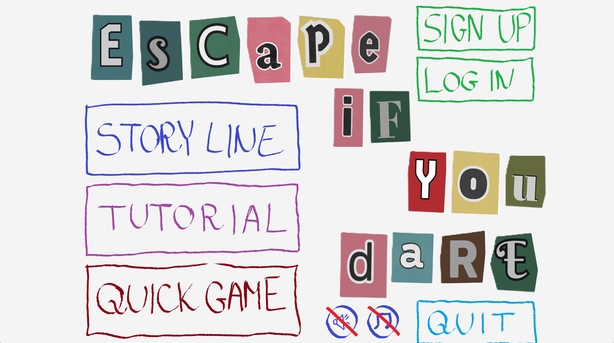
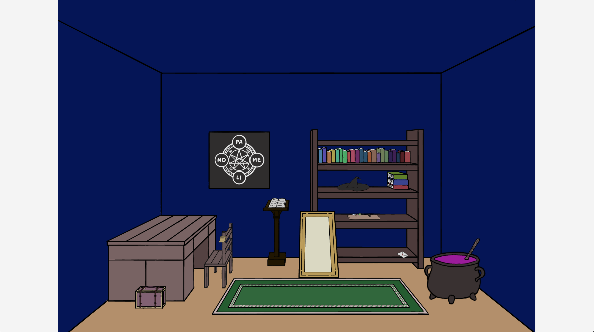
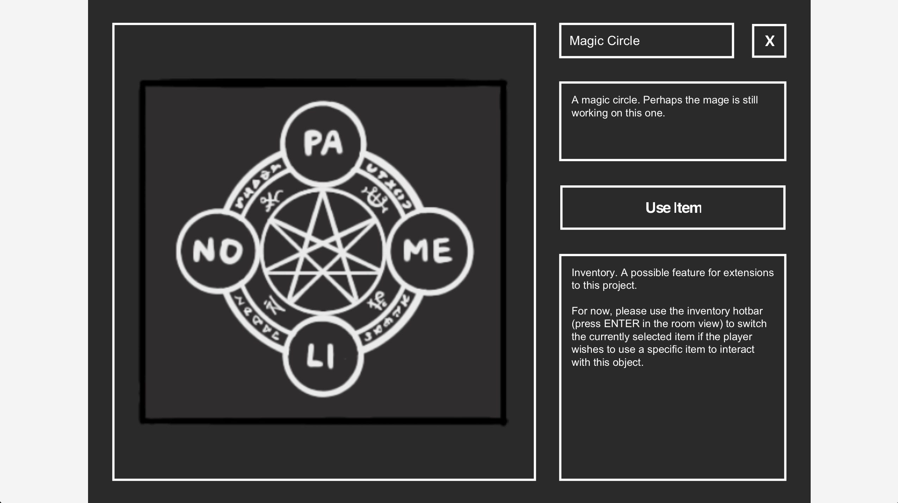
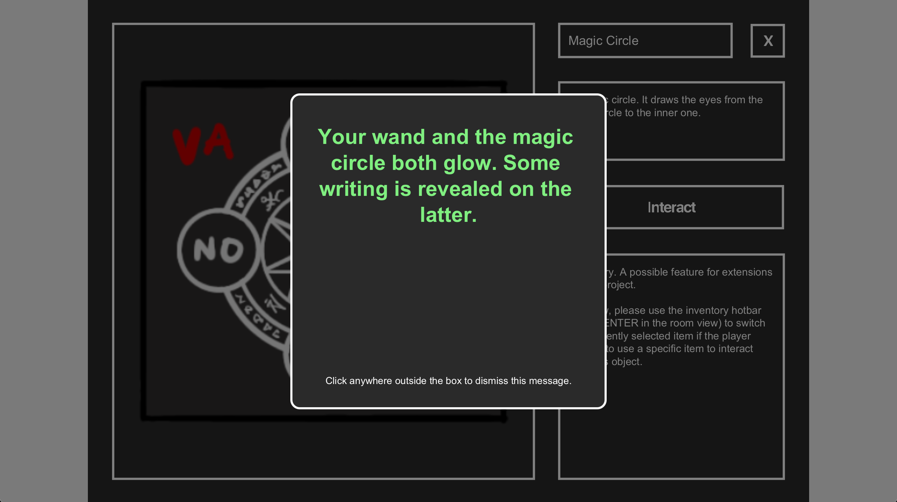
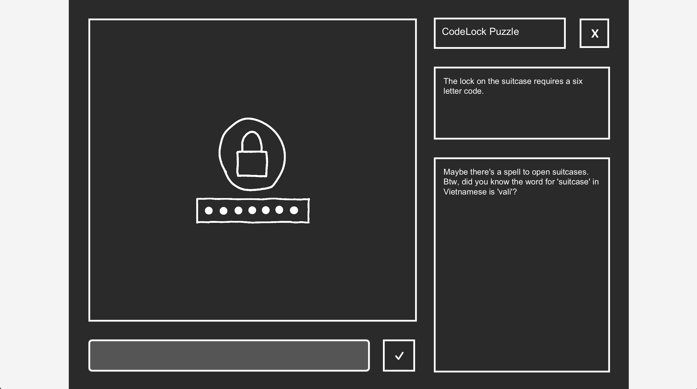

# Escape If You Dare!

A 2D point-and-click escape room game built in Java with JavaFX, developed as our CSC207 term project. This README highlights my contributions to the project and provides an overview of its gameplay and technical implementation.

---

## Table of Contents

- [Gameplay](#gameplay)
- [About the Project](#about-the-project)
- [My Contributions](#my-contributions)
- [Technologies](#technologies)
- [Features](#features)
- [Authors](#authors)
- [Installation](#installation)
- [Usage Guide](#usage-guide)
- [License](#license)
---

## Gameplay

In this section, we will take a look at some of the gameplay elements.



Above is the main menu, which is what appears when you first run Main.java. You have the option to sign up or log in,
but it isn't necessary to play the game. Without logging in, you will play as a guest user, and your
progress will not be saved. 

There are three modes to choose from: Story Line, where you play through multiple connected
rooms to escape; Tutorial, where you can learn how to play; and Quick Game, where you can choose different singular
room games to play through.



Above is one of the game rooms. This is what you will see when you first enter a room. You can use your mouse to click 
on and interact with objects. Objects that can be interacted with will enlarge when the mouse passes over it.



When clicking on an "Interactable" object, you will see the above view. This includes a zoomed in picture of the object,
its name, description, a button for you to interact with it, and your inventory (this is a possible feature for future
improvement).



Interactable objects may or may not require a specific item for interaction. If the player successfully interacts with
the Interactable, then above is the view they will see. A successful interaction may give the player an item, hide a clue
in the success message, allow the player to enter a puzzle, or allow the player to go to another room or escape.



There may be a puzzle linked to an Interactable object. The player can access the puzzle once they successfully interact
with such objects. One of the puzzle types is the Cryptogram puzzle, where a phrase is encrypted using ApiVerve's Cryptogram Generator API
once per game start. The player must use the cipher, as seen above in the bottom right box, to decipher the phrase.

---

## About the Project

We developed a point-and-click escape room game where the player explores interconnected rooms, interacts with objects, collects and combines items, and solves puzzles to progress. We built this project to practice applying Clean Architecture and SOLID design principles to a genuinely interactive, stateful application — something more design-intensive than a typical CRUD (Create, Read, Update, Delete) app, while still being scoped realistically for a team of five over six weeks.

The game is aimed at anyone who enjoys short logic puzzles and light narrative games! Whether you want to play through a connected multi-room story, or just drop into a standalone room for a quick 10–15 minute puzzle session.

---

## My Contributions

This project was developed collaboratively by Team Escapists for CSC207: Software Design at the University of Toronto. 
My primary responsibilities focused on Interactable objects and Puzzle systems.

### Gameplay Systems
- Implemented the gameplay logic for Interactable objects:
- Implemented three puzzle types:
    - Anagram puzzles
    - Cryptogram puzzles
    - Code-lock puzzles
- Integrated external APIs for anagram scrambling and cryptogram encryption.
- Implemented the associated entities and use cases for these gameplay systems.

### User Interface
- Developed JavaFX views for Interactable objects, including the zoomed-in
  interaction view displayed when players examine an object, and an overlay for
  success and failure messages.
- Developed the JavaFX puzzle interface used to interact with puzzle systems.

### Architecture & Testing
- Implemented the corresponding interface adapters following the project's
  Clean Architecture structure.
- Wrote JUnit tests for the entities and use cases associated with my features.

### Game Design
- Designed and drew the room shown above in the [gameplay section](#gameplay).
- Designed and implemented a flexible Interactable object system capable of supporting different object behaviors and interaction requirements.
- Designed and implemented the puzzle system supporting multiple puzzle types.

---

## Technologies

- **Language:** Java 21
- **UI:** JavaFX
- **Build & Dependency Management:** Apache Maven
- **Testing:** JUnit
- **Version Control:** Git / GitHub
- **Architecture:** Clean Architecture, SOLID principles

---

## Features

- **Guest or account play** — jump in immediately as a guest, or create an account to save your progress between sessions.


- **Two ways to play**:
    - **Story Mode** — a connected series of rooms where items and clues found in one room can unlock progress in another.
    - **Quick Game** — browse and play standalone, self-contained escape rooms of varying themes and difficulty.


- **Inventory & item combination** — collect items into a persistent inventory, and combine compatible items to create new tools needed for progression.


- **Multiple puzzle types** — including cryptogram puzzles, anagram puzzles, and combination locks.


- **Tiered hint system** — stuck on a puzzle? Request a hint, delivered in increasing levels of specificity.


- **Pause menu** — save your progress, save & quit, or quit without saving, with clear in-app warnings about which options do and don't preserve your progress.


- **Audio controls** — toggle music and sound effects independently.


- **Resizable, scalable UI** — every screen is built to scale cleanly across different window sizes.

---

## Authors

This project was built by **Team Escapists**:

- Baron, Jadon, Lucas, Skylar, Tina


- Developed for CSC207: Software Design, Summer 2026, University of Toronto.

---

## Installation

### Requirements

| Requirement | Version |
|---|---|
| Java (JDK) | 21 (LTS) |
| Apache Maven | 3.9+ |
| JavaFX | 21.0.2 (pulled automatically via Maven) |


### Steps

1. **Clone the repository:**
```bash
   git clone <repository-url>
   cd escapeRoom
```

2. **Confirm you have Java 21 installed:**
```bash
   java -version
```
If you don't have Java 21, download it from [Adoptium](https://adoptium.net/) or your preferred JDK provider.

3. **Build the project and fetch dependencies** (JavaFX and Gson are declared in `pom.xml` and will be downloaded automatically):
```bash
   mvn clean compile
```

4. **Run the application:**
```bash
   mvn javafx:run
```

Alternatively, if you're using IntelliJ IDEA, open the project, let Maven sync, and run `app.Main` directly via the green run arrow.

### Common Issues

- **"Plugin 'org.openjfx:javafx-maven-plugin:0.0.8' not found"** — this is usually a stale IntelliJ Maven cache, not an actual missing dependency. Open the Maven tool window and click "Reload All Maven Projects."
- **JavaFX native-access warnings on startup** (e.g. `WARNING: A restricted method in java.lang.System has been called`) — these are harmless and don't affect functionality. They stem from JavaFX's internal native rendering code on recent JDK versions.
- **Blank or oversized window on first launch** — if the window opens larger than your screen, press **Alt+F4** (Windows) to close it, then relaunch — this was an early sizing bug that's since been fixed in `ViewManager`.
---

## Usage Guide

1. **Launch the app** — you'll land on the main menu.
2. **Choose to play as a guest, log in, or sign up.** Guests can play immediately but can't save progress between sessions.
3. **Pick a mode**: Story Line (connected multi-room adventure), Tutorial (guided walkthrough of the controls), or Quick Game (browse and pick a standalone room).
4. **Explore the room**: click on objects to examine them, collect items, trigger puzzles & hints.
5. **Use your inventory**: click an item, then click an object in the room to use it. Compatible items can be combined to form new tools.
6. **Stuck?** There are hints hidden in objects, click around and find out!
7. **Pause anytime**: open the pause menu to save your progress, save and quit, or quit without saving — logged-in players only, since guest progress can't be saved.
---

## License

This project is licensed under the MIT License — see the `LICENSE` file for details.

---
